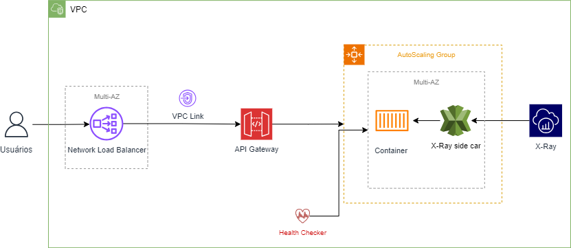

# Introdução do Projeto: API Transferências
O projeto **API Transferências** foi desenvolvido como parte de um desafio técnico com o objetivo de criar uma solução para a validação de transferências financeiras de clientes. Esta API desempenha um papel central na infraestrutura financeira, interagindo de forma integrada com outras APIs, incluindo Cadastro, Contas e Bacen.

## Funcionalidades

1. **Validação de Clientes**: A API verifica se o id do cliente existe através da chamada à **API Cadastro**, assim apenas clientes devidamente cadastrados podem realizar transferências;
2. **Gestão de Contas**:  Integração com a API de Contas para validar id da conta, saldo disponível, limite diário, assegurando que as transferências ocorram apenas quando houver recursos suficientes disponíveis.
3. **Confirmação de Transferências**: Comunicação com a API do Bacen para notificar as transferências.

# Como rodar o projeto
1. Preparar o ambiente:
    - Clonar o repositório do projeto do git para sua máquina local:

```
git clone git@github.com:luana-gruber/desafio-itau-api-transferencias.git
cd desafio-itau-api-transferencias
```

2. Construção dos Containers com Docker Compose:
    - Na raiz do projeto, onde o arquivo docker-compose.yml está localizado, execute o comando abaixo para construir e iniciar todos o container do Wiremock com as API'S mockadas e o container do SonarQube definido no Docker Compose:
```
docker-compose up --build -d
```
3. Excecução do Projeto na IDE:
   - Localizar o arquivo ApiTransferenciaApplication no diretório src/main/java/com/desafioitau/api/transferencia:
     
   - Clicar com o botão direito no arquivo e ir na opçã Run:
     
   - Validar se o projeto rodou com sucesso através do terminal:
     
   
# Integrações
As API's de integração foram disponibilizadas através do Wiremock pelo Matheus Carvalho e podem ser localizadas no Git:
```
https://github.com/mllcarvalho/DesafioItau
```

# Tecnologias
A aplicação foi desenvolvida com as principais tecnologias:
1. Java  - Linguagem do projeto 
2. SpringBoot - Framework para desenvolver aplicações web
3. Maven - Automação de compilação e dependências
4. JUnit - Testes automatizados
5. Mockito - Criação de mocks  para teste unitários
6. Jacoco - Cobertura de teste do código da aplicação
7. SonarQube - Análise estática do código para melhorar qualidade

# Diagramas
1. Diagrama de classe da aplicação:
   
2. Diagrama de sequência macro:


# Arquitetura AWS
Como parte do desafio foi solicitado o desenho da solução na arquitetura AWS, também disponibilizei os arquivos terraform que seriam necessários para implementação na AWS. Estão disponibilizados na pasta terraform do projeto.


# Sonar 
1. Análises
Não foi solicitado no desafio, mas realizei a implementação como parte de uma decisão estratégica para demonstrar compromisso com a qualidade do código e a sustentabilidade do projeto a longo prazo.
Dashs finais disponibilizados pelo Sonar:
   
   

2. Como rodar o Sonar localmente:
   - Após inicializar os containers, utilize o comando abaixo para realizar a análise do código:
```
 mvn clean verify sonar:sonar
```
 - Aguarde o final do build e acesse no endereço:
```
   http://localhost:9000/
```
 - A senha e usuário inicial são admin e admin, o Sonar vai lhe dar a opção de trocar de senha.
 - Crie um novo projeto no Sonar nas opções:
   - Manually;
   - Preencha nome, key (pode ser o mesmo nome), branch e clique em Setup;
   - Selecione Locally e gere o token de acesso, salve e rode os comandos da página;
   - Rode o sonar e veja os dashs da sua aplicação.

# Postman
Deixei a collection com todas as rotas disponibilizadas no postman:

[Clique aqui para baixar as collections](./docs/postman/Transferencias.postman_collection.json)